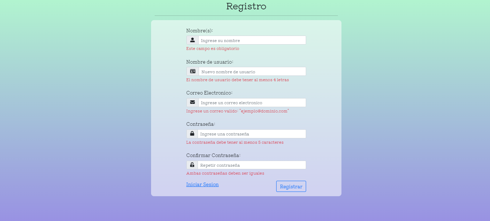

# Formularios Reactivos Angular 

### Frontend de un registro para validar y mostrar distintos tipo de errores

Validación mediante formularios reactivos,

1. Control de errores.
2. Validación del campo nombre. 
3. Valicación del campo usuario. 
4. Validación del campo Correo.
5. Validación del campo de contraseñas no iguales.

#### Capturas

### Demo en netlify:
https://musing-wozniak-6e1e70.netlify.app
